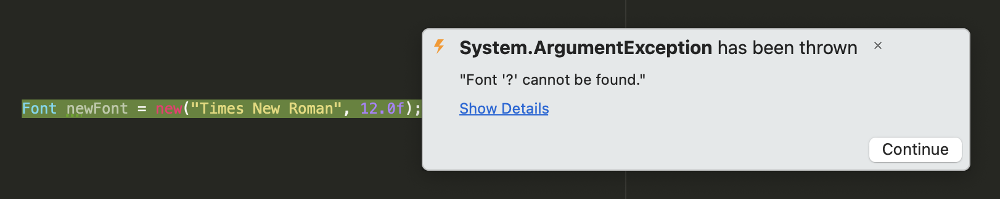

# Load custom font in **C#**

 This utility helps to add any font you want from your local machine to **System.Drawing.Font** library. 
 
 # Reasons to use this utility

 **Windows OS** users usually don't have any problems with using fonts from **System.Drawing.Font library**. However, **Mac OS** users face with exceptions/unexpected behaviours while using **System.Drawing.Font**.

 You can see list of errors/exceptions while trying to use native fonts provided by **System.Drawing.Font**:

 + 

 + 

 # You can get over these problems by just adding any **.ttf** file to your **System.Drawing.Font** library as shown below:

 + 